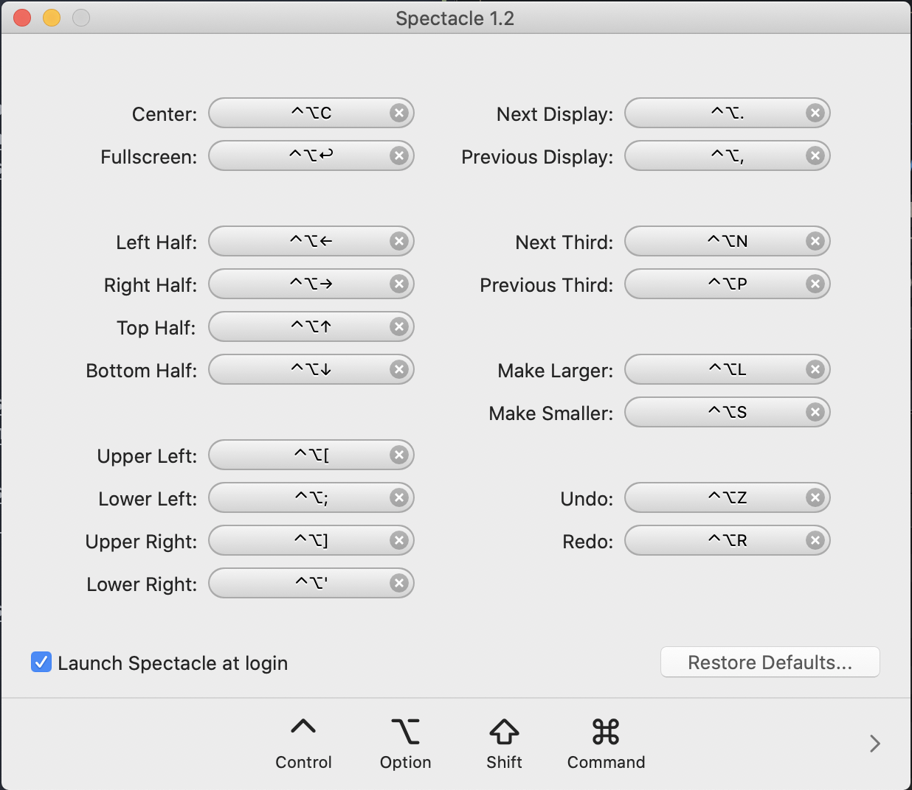
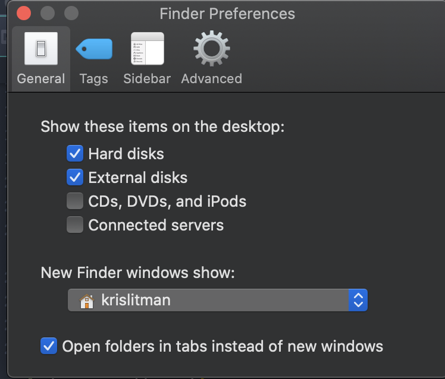

# OSX Setup

> When first setting up your environment, follow these steps to get started.

1. Install the latest version of OSX
2. Connect to Wifi
3. Install latest OSX updates
4. Install these the latest versions of these applications:
   - [Google Chrome](https://www.google.com/chrome/)
   - [Visual Studio Code](https://code.visualstudio.com/)
   - [Iterm2](https://iterm2.com/)
   - [Postman](https://www.postman.com/)
   - [Docker](https://www.docker.com/)
   - [Postico](https://eggerapps.at/postico/)
   - [Notion](https://www.notion.so/)
   - [Slack](https://slack.com/)
   - [Zoom](https://zoom.us/)
   - [Teams](https://teams.microsoft.com/edustart)
   - [Spotify](https://www.spotify.com/us/home/)
   - [Flux](https://justgetflux.com/)
   - [Loom](https://www.loom.com/)
   - [Tuple](https://tuple.app/)
5. Set up window management with [Spectacle](https://www.spectacleapp.com/):

6. In `System Preferences/General` select the `Dark Mode` for appearance
   - Set default web browser to `Google Chrome`
   - Accent mode to `graphite`
7. In `System Preferences/Dock` set the position to `Bottom`
8. In `System Preferences/Trackpad` set tracking to `5`
9. In `Keyboard` settings check to user the F1, F2.. as standard function keys
10. In `Finder Settings` show harddrive on disk and new finder windows

11. In `Google Chrome` set up syncing with profile, make sure these extensions are installed:
    -  [Dark Reader](https://chrome.google.com/webstore/detail/dark-reader/eimadpbcbfnmbkopoojfekhnkhdbieeh)
    -  [JSON Formatter](https://chrome.google.com/webstore/detail/json-formatter/bcjindcccaagfpapjjmafapmmgkkhgoa)
    -  [Loom](https://chrome.google.com/webstore/detail/loom-for-chrome/liecbddmkiiihnedobmlmillhodjkdmb)
    -  [Edit This Cookie](https://chrome.google.com/webstore/detail/editthiscookie/fngmhnnpilhplaeedifhccceomclgfbg)
    -  [Pom Timer](https://chrome.google.com/webstore/detail/marinara-pomodoro%C2%AE-assist/lojgmehidjdhhbmpjfamhpkpodfcodef)
    -  [AdBlock](https://chrome.google.com/webstore/detail/adblock-%E2%80%94-best-ad-blocker/gighmmpiobklfepjocnamgkkbiglidom)
    -  [Nord Theme](https://chrome.google.com/webstore/detail/nord/abehfkkfjlplnjadfcjiflnejblfmmpj)
12. Set up `iStat` and remove battery icon, date/time, and display mirroring from the navigation bar
13. Adjust `Flux` to custom colors, do not use classic mode

