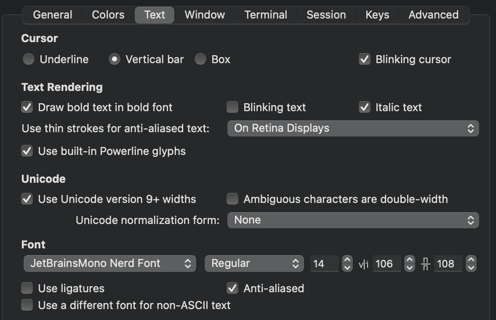

# Initial Configuration

1. Download stable build of [Xcode Developer Tools](https://developer.apple.com/xcode/resources/)
2. Confirm tools are installed by running `xcode-select --install` in iTerm
3. Install Homebrew:
`(curl -fsSL https://raw.githubusercontent.com/Homebrew/install/master/install)"`
4. Run `brew doctor` to confirm it is installed and `ready to brew`
5. Update with `brew update`
6. Grab latest version of git `brew install git`
7. Install [GitHub CLI](https://cli.github.com/) `brew install gh`
8. Install fuzzy finder `brew install fzf`
9. Install [Oh-My-Zsh](https://ohmyz.sh/): `sh -c "$(curl -fsSL https://raw.github.com/ohmyzsh/ohmyzsh/master/tools/install.sh)"`
  - Plugins: fzf, osx, web-search, fast-syntax-highlighting, zsh-interactive-cd, zsh-autosuggestions, autojump
10. Install autojump `brew install autojump`
11. Install Heroku CLI with `brew install heroku/brew/heroku`

# Iterm2 Settings

1. Quit when all windows are closed
2. [Synchronize theme with VSCode](https://marketplace.visualstudio.com/items?itemName=tusaeff.vscode-iterm2-theme-sync)
3. Silence bell
4. Configure helpful [shortcuts](https://coderwall.com/p/h6yfda/use-and-to-jump-forwards-backwards-words-in-iterm-2-on-os-x)
5. [More shortcuts for delete current line](https://stackoverflow.com/questions/15733312/iterm2-delete-line)

### Appearance Settings

  

### Profile Settings

