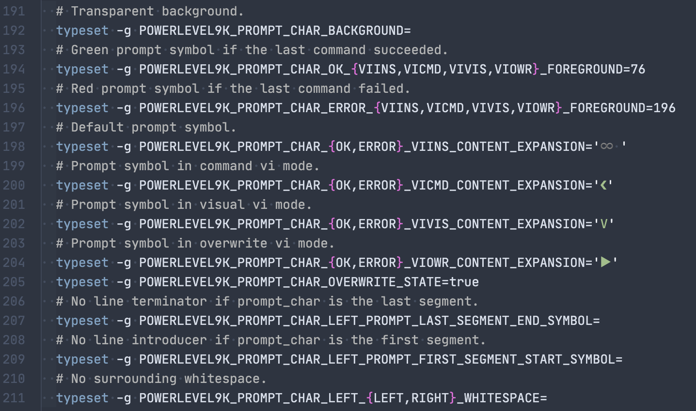
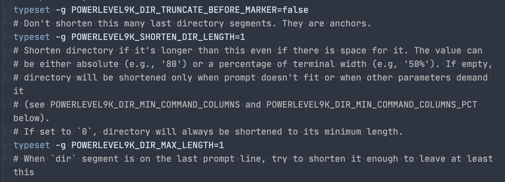
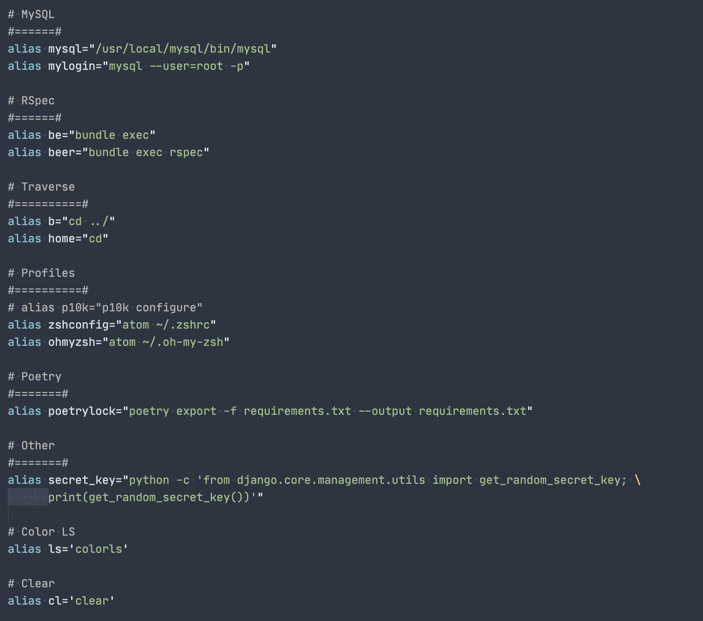
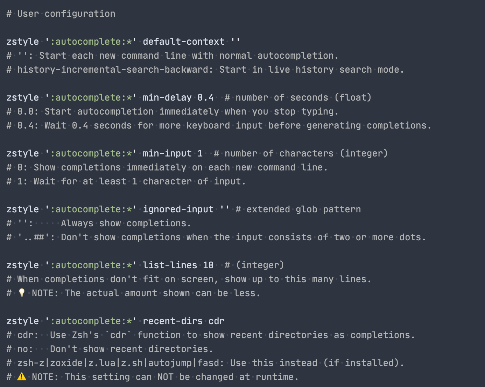
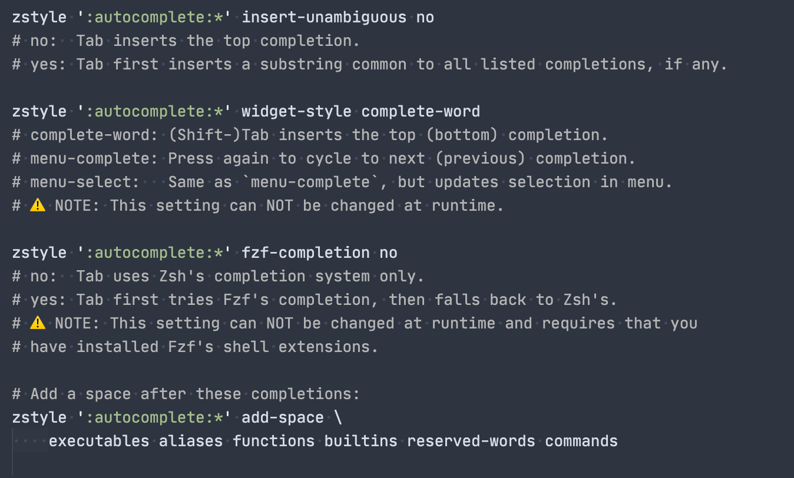

# P10k

> Install [Powerlevel10k](https://github.com/romkatv/powerlevel10k)

- In iTerm, type `p10k configure` to walk through the builtin configuration wizard

### Settings kept in `~/.p10k.zsh`

- Change prompt symbol
  
- Adjust what elements to show
  
- Truncate filepath
  
    

## Oh My Zsh Settings

- In `~/.zshrc`
  
  
  
  
