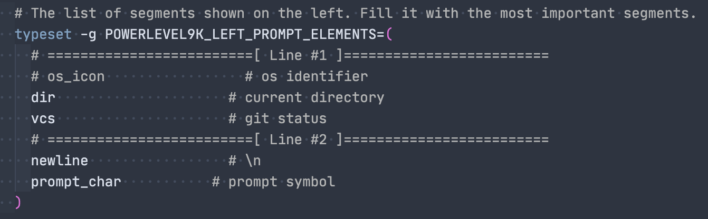

# P10k

>Install [Powerlevel10k](https://github.com/romkatv/powerlevel10k)

- In iTerm, type `p10k configure` to walk through the builtin configuration wizard

### Settings kept in `~/.p10k.zsh`

- Change prompt symbol

- Adjust what elements to show

- Truncate filepath

